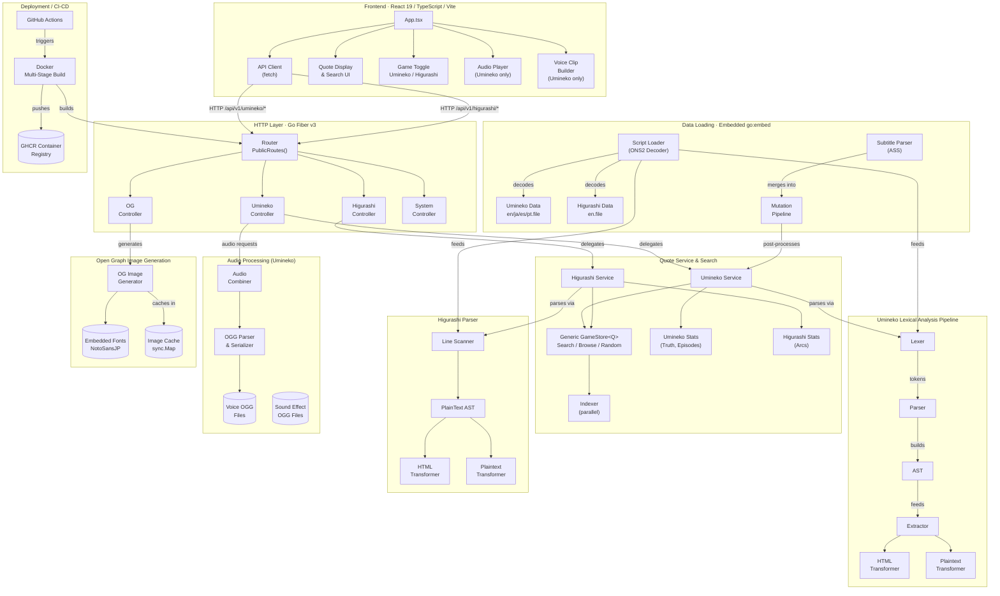

# Umineko & Higurashi Quote Search

A quote search engine for Umineko no Naku Koro ni and Higurashi no Naku Koro ni. Search through thousands of lines of dialogue from both visual novels.

## System Architecture



## Contents

- [System Architecture](#system-architecture)
- [Features](#features)
- [Quick Start](#quick-start)
  - [Voice Audio (Optional)](#voice-audio-optional)
  - [Expected zip structure](#expected-zip-structure)
- [API Endpoints](#api-endpoints)
  - [Query Parameters](#query-parameters)
  - [Response Format](#response-format)
- [Swagger](#swagger)
- [Build](#build)
  - [Cross-compile](#cross-compile)
- [Docker](#docker)
- [Data](#data)
  - [Script Loader](#script-loader)
  - [Mutation Engine Pipeline](#mutation-engine-pipeline)
- [Architecture: The Script Parser](#architecture-the-script-parser)
  - [Pipeline Overview](#pipeline-overview)
  - [Package Structure](#package-structure)
  - [Key Design Decisions](#key-design-decisions)
- [Script Tag Parsing](#script-tag-parsing)
  - [Tags with HTML rendering](#tags-with-html-rendering)
  - [Preset colour reference](#preset-colour-reference)
  - [Tags stripped to content](#tags-stripped-to-content)
  - [Special character tags](#special-character-tags)
  - [Other cleanup](#other-cleanup)
- [Contributors](#contributors)

## Features

- **Multi-game support** with in-app toggle between Umineko and Higurashi
- Search through all dialogue with full-text search
- Filter by character, episode (Umineko), arc (Higurashi), and truth type (Umineko)
- Character interaction pair filtering
- Random quote generator
- Scene context viewer with navigation between voiced quotes
- Multi-language support: English, English (WH), Japanese, Russian, Spanish, Portuguese (Umineko); English + inline Japanese (Higurashi)
- Inline audio playback for voiced lines (Umineko)
- Voice clip builder for composing custom dialogue sequences (Umineko)
- Per-game bookmarks with localStorage persistence
- Open Graph image generation for sharing quotes
- Statistics dashboards with interactive charts
- Themed web interface with multiple visual themes

## Quick Start

```bash
# Build the frontend
cd frontend
npm install
npm run build
cd ..

# Build and run the Go server
go build -o umineko_quote .
./umineko_quote
```

Open http://127.0.0.1:3000

### Development

For frontend development with hot reload, run the Vite dev server alongside the Go backend:

```bash
# Terminal 1: Go backend
go run main.go

# Terminal 2: Vite dev server (proxies /api to :3000)
cd frontend
npm run dev
```

Open http://localhost:5173

### Voice Audio (Optional)

Audio playback requires a zip of the voice files. Create a `.env` file in the project root:

```env
# URL to download the zip
VOICE_ZIP_URL=https://example.com/voice.zip

# Or a local path to the zip
VOICE_ZIP_URL=C:\path\to\voice.zip
```

### Sound Effects (Optional)

Sound effect playback requires a zip of the SE files. Add to the same `.env` file:

```env
SE_ZIP_URL=https://example.com/se.zip
```

Then run the setup script:

**Linux / macOS:**
```bash
./setup_audio.sh
```

**Windows (PowerShell):**
```powershell
.\setup_audio.ps1
```

The script will detect whether each URL is a local file or a URL and handle it accordingly. If the directory already exists, it skips extraction. Both voice and SE are optional; the app works without them, but quotes will display without playback controls or sound effect buttons.

### Expected zip structure

The voice zip must contain a `voice/` directory at its root with character ID subdirectories:

```
voice.zip
└── voice/
    ├── 00/
    │   ├── 00100001.ogg
    │   └── ...
    ├── 01/
    └── ...
```

The SE zip must contain an `se/` directory at its root with OGG files:

```
se.zip
└── se/
    ├── umise_001.ogg
    ├── umise_002.ogg
    ├── umilse_001.ogg
    └── ...
```

## API Endpoints

Both games share the same endpoint structure under their respective prefixes.

### Umineko — `/api/v1/umineko/`

| Endpoint                                       | Description                            |
|------------------------------------------------|----------------------------------------|
| `GET /api/v1/umineko/search`                   | Search quotes                          |
| `GET /api/v1/umineko/random`                   | Get random quote                       |
| `GET /api/v1/umineko/browse`                   | Browse quotes with pagination          |
| `GET /api/v1/umineko/quote/:audioId`           | Get quote by audio ID                  |
| `GET /api/v1/umineko/quote/index/:index`       | Get quote by script index              |
| `GET /api/v1/umineko/context/:audioId`         | Get surrounding dialogue for a quote   |
| `GET /api/v1/umineko/nearest-voiced/:audioId`  | Find nearest voiced quote              |
| `GET /api/v1/umineko/characters`               | List all character IDs and names       |
| `GET /api/v1/umineko/stats`                    | Get quote statistics                   |
| `GET /api/v1/umineko/audio/voice/:charId/:id`  | Stream voice audio file                |
| `GET /api/v1/umineko/audio/voice/combined`     | Stream combined voice clips            |
| `GET /api/v1/umineko/audio/se/:filename`       | Stream a sound effect file             |
| `GET /api/v1/umineko/og/:audioId.png`          | Generate OG image for a quote          |

### Higurashi — `/api/v1/higurashi/`

| Endpoint                                        | Description                            |
|-------------------------------------------------|----------------------------------------|
| `GET /api/v1/higurashi/search`                  | Search quotes                          |
| `GET /api/v1/higurashi/random`                  | Get random quote                       |
| `GET /api/v1/higurashi/browse`                  | Browse quotes with pagination          |
| `GET /api/v1/higurashi/quote/:audioId`          | Get quote by audio ID                  |
| `GET /api/v1/higurashi/quote/index/:index`      | Get quote by script index              |
| `GET /api/v1/higurashi/context/:audioId`        | Get surrounding dialogue for a quote   |
| `GET /api/v1/higurashi/nearest-voiced/:audioId` | Find nearest voiced quote              |
| `GET /api/v1/higurashi/characters`              | List all character IDs and names       |
| `GET /api/v1/higurashi/stats`                   | Get quote statistics                   |
| `GET /api/v1/higurashi/og/:audioId.png`         | Generate OG image for a quote          |

### System

| Endpoint               | Description   |
|------------------------|---------------|
| `GET /api/v1/health`   | Health check  |
| `GET /api/v1/config`   | App config    |

### Query Parameters

| Parameter      | Endpoints                    | Description                                              |
|----------------|------------------------------|----------------------------------------------------------|
| `q`            | search                       | Search query (required)                                  |
| `lang`         | search, random, browse, etc. | Language: `en` (default), `wh`, `ja`, `ru`, `es`, `pt`  |
| `character`    | search, random, browse       | Filter by character ID                                   |
| `episode`      | search, random, browse       | Filter by episode number                                 |
| `truth`        | search, random, browse       | Umineko only: `red`, `blue`, `gold`, `purple`            |
| `arc`          | search, random, browse       | Higurashi only: arc name (e.g. `onikakushi`)             |
| `interactionA` | search, browse               | First character ID for interaction pair filter            |
| `interactionB` | search, browse               | Second character ID for interaction pair filter           |
| `lines`        | context                      | Number of lines before/after (default: 5, max: 20)       |
| `limit`        | search, browse               | Results per page (default: 30)                           |
| `offset`       | search, browse               | Pagination offset                                        |

### Response Format

```json
{
  "results": [
    {
      "quote": {
        "text": "Without love, it cannot be seen.",
        "textHtml": "Without love, it cannot be seen.",
        "characterId": "27",
        "character": "Beatrice",
        "audioId": "10100001",
        "episode": 1,
        "contentType": ""
      },
      "score": 95
    }
  ]
}
```

The `contentType` field distinguishes content sections: `""` for main episodes, `"tea"` for tea parties, `"ura"` for ???? chapters, and `"omake"` for omakes (bonus content).

Higurashi quotes additionally include `textJp`, `textJpHtml` (inline Japanese text), and `arc` (arc name) fields.

## Swagger

API documentation is served at `/swagger/index.html` via [swaggo/swag](https://github.com/swaggo/swag). The `docs/` package is generated from annotations in the controller files.

To regenerate after changing annotations:

```bash
go install github.com/swaggo/swag/cmd/swag@latest
swag init --parseDependency --parseInternal
```

Docker builds run `swag init` automatically, so committing the generated `docs/` directory is not required for deployment.

## Build

The frontend must be built before the Go binary, as the Go binary embeds the `static/` directory.

```bash
cd frontend && npm ci && npm run build && cd ..
```

### Windows
```powershell
swag init --parseDependency --parseInternal
go build -o umineko_quote.exe .
```

### Linux
```bash
swag init --parseDependency --parseInternal
go build -o umineko_quote .
```

### Cross-compile

```powershell
# Mac ARM (M1/M2/M3)
$env:GOOS="darwin"; $env:GOARCH="arm64"; go build -o umineko_quote_mac .; $env:GOOS=""; $env:GOARCH=""

# Mac Intel
$env:GOOS="darwin"; $env:GOARCH="amd64"; go build -o umineko_quote_mac_intel .; $env:GOOS=""; $env:GOARCH=""

# Linux x64
$env:GOOS="linux"; $env:GOARCH="amd64"; go build -o umineko_quote_linux .; $env:GOOS=""; $env:GOARCH=""
```

## Docker

Requires a `.env` file with `VOICE_ZIP_URL` set (URL only for Docker builds). `SE_ZIP_URL` is optional.

```bash
docker compose up -d --build
```

## Data

Quote data is parsed from script files for both games. The scripts are stored in ONS2-encoded `.file` format (compressed and obfuscated) and decoded at startup.

```
internal/quote/data/
├── en.file              (Umineko English, ONS2 encoded)
├── ja.file              (Umineko Japanese, ONS2 encoded)
├── es.file              (Umineko Spanish, ONS2 encoded)
├── pt.file              (Umineko Portuguese, ONS2 encoded)
├── wh.file              (Umineko English WH, ONS2 encoded)
├── ru.file              (Umineko Russian, ONS2 encoded)
├── higurashi/
│   └── en.file          (Higurashi English, ONS2 encoded)
├── sub/                 (ASS subtitle files for Umineko)
├── audio/               (Umineko voice files, extracted via setup script)
│   ├── 00/
│   ├── 01/
│   └── ...
└── se/                  (Umineko sound effects, extracted via setup script)
    ├── umise_001.ogg
    └── ...
```

`.file` data is embedded at compile time and decoded in memory at startup via the script loader. Audio and SE files are read from disk at runtime.

### Script Loader

The `internal/quote/scriptloader` package owns the full data pipeline: decode -> parse -> subtitle resolution -> mutation fixes. The service calls `loader.Load(lang, path)` and receives clean `[]dto.ParsedQuote` back.

The loader decodes the ONS2 format (XOR substitution cipher + ZLIB compression), splits the result into lines, runs the parser, resolves subtitle references from embedded `.ass` files, and applies the mutation engine pipeline before returning.

### Mutation Engine Pipeline

The `internal/quote/mutation` package provides an extensible pipeline for applying post-parse data integrity fixes. Some script data contains known errors (e.g. misattributed character IDs) that cannot be fixed in the encoded source files.

```
internal/quote/mutation/
├── mutation.go                          # Engine interface + Pipeline
└── engine/
    └── kanon_attribution_engine.go      # Fixes Kanon/Erika misattribution
```

To add a new fix:
1. Create a new file in `mutation/engine/`
2. Implement the `mutation.Engine` interface (`Apply([]dto.ParsedQuote) []dto.ParsedQuote`)
3. Register it in `mutation.NewPipeline()`

## Architecture: The Script Parser

The [`umineko_script_parser`](https://github.com/VictoriqueMoe/umineko_script_parser) library handles parsing both Umineko and Higurashi script files. It uses a shared interface layer with game-specific implementations.

### Shared Interfaces

Both games share:
- `dialogue.DialogueElement` interface with sub-interfaces (`TextElement`, `ContainerElement`, `SpecialCharElement`)
- `transformer.Transformer` interface for converting AST to output format
- `transformer.Factory` for registering and retrieving transformers
- `dto.BaseQuote` with common fields (Text, TextHtml, CharacterID, Character, AudioID, Episode, etc.)

Game-specific extensions:
- `dto.UminekoQuote` adds truth flags (HasRedTruth, HasBlueTruth, HasGoldTruth, HasPurpleTruth)
- `dto.HigurashiQuote` adds TextJP, TextJPHtml, and Arc fields

### Pipeline Overview

**Umineko** uses a full lexer -> parser -> AST -> extractor pipeline with recursive descent parsing of nested format tags:

```
┌─────────────────────────────────────────────────────────────────────────────┐
│                              Source Text                                    │
│  d [lv 0*"27"*"10100001"]`"{p:1:Without love, it cannot be seen.}"`[\]     │
└─────────────────────────────────────────────────────────────────────────────┘
                                      │
                                      ▼
┌─────────────────────────────────────────────────────────────────────────────┐
│                           LEXER (lexer.go)                                  │
│  Tokenises input into a stream of typed tokens                              │
│  • TokenCommand: "d"                                                        │
│  • TokenInlineCommand: "lv 0*\"27\"*\"10100001\""                           │
│  • TokenBacktick: "`"                                                       │
│  • TokenFormatTag: "p:1:Without love, it cannot be seen."                   │
│  • etc.                                                                     │
└─────────────────────────────────────────────────────────────────────────────┘
                                      │
                                      ▼
┌─────────────────────────────────────────────────────────────────────────────┐
│                          PARSER (parser.go)                                 │
│  Builds Abstract Syntax Tree from tokens                                    │
│                                                                             │
│  Script                                                                     │
│   └── Lines[]                                                               │
│        ├── EpisodeMarkerLine { Episode: 1, Type: "episode" }                │
│        ├── PresetDefineLine { ID: 1, Colour: "#FF0000" }                    │
│        ├── LabelLine { Name: "ep1_scene1" }                                 │
│        └── DialogueLine                                                     │
│             ├── Command: "d"                                                │
│             └── Content[]                                                   │
│                  ├── VoiceCommand { CharacterID: "27", AudioID: "..." }     │
│                  └── FormatTag { Name: "p", Param: "1", Content: [...] }    │
└─────────────────────────────────────────────────────────────────────────────┘
                                      │
                                      ▼
┌─────────────────────────────────────────────────────────────────────────────┐
│                       VALIDATOR (validator.go)                               │
│  Post-parse AST validation (non-fatal)                                      │
│                                                                             │
│  • Unknown format tags        • Missing voice command fields                │
│  • Missing episode numbers    • Logged at startup, never blocks parsing     │
└─────────────────────────────────────────────────────────────────────────────┘
                                      │
                                      ▼
┌─────────────────────────────────────────────────────────────────────────────┐
│                       EXTRACTOR (extractor.go)                              │
│  Walks AST, extracts quotes with metadata                                   │
│                                                                             │
│  ExtractedQuote {                                                           │
│      Content:     []DialogueElement  ◄── Raw AST, not yet transformed       │
│      CharacterID: "27"                                                      │
│      AudioID:     "10100001"                                                │
│      Episode:     1                                                         │
│      Truth:       { HasRed: true, HasBlue: false, ... }                     │
│      SoundEffects: [{ SeNum: 47, AfterClip: 0 }, ...]                      │
│  }                                                                          │
└─────────────────────────────────────────────────────────────────────────────┘
                                      │
                                      ▼
┌─────────────────────────────────────────────────────────────────────────────┐
│                   TRANSFORMER FACTORY (transformer/)                        │
│  Converts raw AST to output format on demand                                │
│                                                                             │
│  factory.MustGet(FormatPlainText) ──► "Without love, it cannot be seen."    │
│  factory.MustGet(FormatHTML)      ──► "<span class=\"red-truth\">...</span>"│
│  factory.MustGet(FormatJSON)      ──► (add your own transformer)            │
└─────────────────────────────────────────────────────────────────────────────┘
```

**Higurashi** uses a line-by-line state machine scanner, since the Higurashi script format is simpler (no nested tags):

```
┌─────────────────────────────────────────────────────────────────────────────┐
│                              Source Text                                    │
│  //!file:onikakushi                                                         │
│  PlayVoice(4, "ps3/s01/01/hrs010010", 256);                                │
│  OutputLine(NULL, "...", NULL, "...", Line_Normal);                         │
└─────────────────────────────────────────────────────────────────────────────┘
                                      │
                                      ▼
┌─────────────────────────────────────────────────────────────────────────────┐
│                     LINE SCANNER (parser.go)                                │
│  Processes script line-by-line with a state machine                         │
│                                                                             │
│  • PlayVoice()     → captures voice segment (charId, audioId)               │
│  • OutputLine()    → captures dialogue text + character                     │
│  • //!file:        → tracks current arc                                     │
│  • ClearMessage()  → flushes accumulated quote                              │
└─────────────────────────────────────────────────────────────────────────────┘
                                      │
                                      ▼
┌─────────────────────────────────────────────────────────────────────────────┐
│                   TRANSFORMER FACTORY (transformer/)                        │
│  Same shared interface as Umineko, game-specific implementations            │
│                                                                             │
│  factory.MustGet(FormatPlainText) ──► "Keiichi-san, welcome home!"          │
│  factory.MustGet(FormatHTML)      ──► "Keiichi-san, welcome home!"          │
└─────────────────────────────────────────────────────────────────────────────┘
```

### Package Structure

The parser is an external library at [`umineko_script_parser`](https://github.com/VictoriqueMoe/umineko_script_parser):

```
dialogue/                   # Shared DialogueElement interface
transformer/                # Shared Transformer interface + Factory
dto/                        # Shared BaseQuote + game-specific DTOs
umineko/
├── lexer/
│   ├── ast/                # Umineko AST types (implements dialogue.*)
│   ├── transformer/        # Umineko transformers (HTML, plaintext)
│   ├── lexer.go            # Tokeniser
│   ├── parser.go           # Recursive descent parser
│   ├── validator.go        # Post-parse validation
│   ├── extractor.go        # Quote extraction with SE association
│   └── truth.go            # Red/blue/gold/purple truth detection
├── scriptparser.go         # Entry point: ParseFile / ParseScriptText
└── decoder/                # ONS2 decoder
higurashi/
├── ast/                    # Simple PlainText AST (implements dialogue.*)
├── transformer/            # Higurashi transformers (HTML, plaintext)
├── character/              # Character ID mapping (39+ characters)
├── parser.go               # Line-by-line state machine
└── scriptparser.go         # Entry point: ParseFile / ParseScriptText
```

### Key Design Decisions

**AST stores raw content**, the extractor outputs `ExtractedQuote` with raw `[]DialogueElement`, not pre-transformed strings. This allows transformation to happen on-demand via the factory.

**Factory pattern for transformers**, adding a new output format (e.g., JSON, Markdown) requires:
1. Implement the `Transformer` interface
2. Register it in the factory

No changes are needed to the extractor or parser.

**Generic GameStore**, the consumer service uses `GameStore[Q any]` to share search, browse, random, context, and nearest-voiced logic between both games. Each game provides a `base func(*Q) *BaseQuote` accessor so the generic store can access common fields.

**Preset context**, colour presets (`{p:1:text}`) are defined in script headers via `preset_define`. The `PresetContext` collects these definitions and provides semantic class lookups (preset 1 -> "red-truth", preset 2 -> "blue-truth") and dynamic colour lookups for other presets.

**Truth detection**, red, blue, gold, and purple truth are detected by walking the AST looking for preset tags with semantic classes. This is stored as `TruthFlags` with `HasRed`, `HasBlue`, `HasGold`, and `HasPurple` booleans, allowing quotes with mixed truth to appear in multiple filters.

## Script Tag Parsing

The source text files use [ONScripter-RU](https://github.com/umineko-project/onscripter-ru) dialogue formatting. The parser strips or converts these tags for display. Tags are processed in a loop to handle nesting (e.g. `{nobr:{m:-5:——}—}`).

### Tags with HTML rendering

| Script tag                          | Plain text     | HTML                                                    |
|-------------------------------------|----------------|---------------------------------------------------------|
| `{n}`                               | space          | `<br>`                                                  |
| `{i:text}` / `{italic:text}`        | text           | `<em>text</em>`                                         |
| `{c:HEX:text}` / `{color:HEX:text}` | text           | `<span style="color:#HEX">text</span>`                  |
| `{p:1:text}` (red truth)            | text           | `<span class="red-truth">text</span>`                   |
| `{p:2:text}` (blue truth)           | text           | `<span class="blue-truth">text</span>`                  |
| `{p:41:text}` (gold text)           | text           | `<span style="color:#FFAA00">text</span>`               |
| `{p:42:text}` (purple text)         | text           | `<span style="color:#AA71FF">text</span>`               |
| `{ruby:reading:text}`               | text (reading) | `<ruby>text<rp>(</rp><rt>reading</rt><rp>)</rp></ruby>` |

### Preset colour reference

The `{p:N:text}` tag applies a style preset defined in the script header via `preset_define`. The format is `preset_define number,font,size,colour,...`. Only presets that appear in actual dialogue lines are rendered with colour; the rest are stripped to plain text.

**Game presets** (used in dialogue):

| Preset | Colour    | Usage         | Rendering                           |
|--------|-----------|---------------|-------------------------------------|
| 0      | `#FFFFFF` | Japanese font | Stripped (white on dark is default) |
| 1      | `#FF0000` | Red truth     | `<span class="red-truth">`          |
| 2      | `#39C6FF` | Blue truth    | `<span class="blue-truth">`         |
| 7      | `#C0FFFF` | Chapter/Hint  | Not used in dialogue                |
| 41     | `#FFAA00` | Gold text     | `<span style="color:#FFAA00">`      |
| 42     | `#AA71FF` | Purple text   | `<span style="color:#AA71FF">`      |

**Menu/UI presets** (not rendered, stripped to plain text if they appear):

| Preset | Usage                          |
|--------|--------------------------------|
| 3      | Menu character text            |
| 4      | Menu JP text                   |
| 5      | Menu tips/notes text           |
| 6      | Music box BGM titles           |
| 8–9    | Menu titles and buttons        |
| 10     | Menu first setting line        |
| 11–12  | Menu buttons                   |
| 13     | Menu tips/notes titles         |
| 14–16  | Menu jump titles/lines         |
| 18     | Trophy description             |
| 20–25  | Credits                        |
| 30–31  | Load/Save                      |
| 32     | EP8 menu murder                |

### Tags stripped to content

These tags control visual styling in the game engine (font size, spacing, line breaking, gradients, etc.) that doesn't apply in a web context. The tag is removed and the inner text is kept.

| Script tag                                 | Result      |
|--------------------------------------------|-------------|
| `{f:N:text}` / `{font:N:text}`             | text        |
| `{p:N:text}` (other presets)               | text        |
| `{bold:text}` / `{b:text}`                 | text        |
| `{bolditalic:text}` / `{x:text}`           | text        |
| `{underline:text}` / `{u:text}`            | text        |
| `{gradient:N:text}` / `{g:N:text}`         | text        |
| `{nobreak:text}` / `{nobr:text}`           | text        |
| `{fit:text}` / `{j:text}`                  | text        |
| `{center:text}` / `{ac:text}`              | text        |
| `{fontsize:N:text}` / `{d:N:text}`         | text        |
| `{fontsizepercent:N:text}` / `{e:N:text}`  | text        |
| `{characterspacing:N:text}` / `{m:N:text}` | text        |
| `{border:N:text}` / `{o:N:text}`           | text        |
| `{shadow:X,Y:text}` / `{s:X,Y:text}`       | text        |
| `{shadowcolor:HEX:text}` / `{v:HEX:text}`  | text        |
| `{bordercolor:HEX:text}` / `{r:HEX:text}`  | text        |
| `{width:text}` / `{w:text}`                | text        |
| `{loghint:hint:text}` / `{l:hint:text}`    | text        |
| `{a:param:text}` (alignment)               | text        |
| `{n:N:text}` (conditional, default shown)  | text        |
| `{y:N:text}` (conditional, not default)    | *(removed)* |
| Any other `{Tag:...:text}`                 | text        |

### Special character tags

These are replaced before other processing.

| Tag                  | Replacement                            |
|----------------------|----------------------------------------|
| `{0}`                | *(zero-width space, removed)*          |
| `{-}`                | *(soft hyphen, removed)*               |
| `{qt}`               | `"`                                    |
| `{ob}` / `{eb}`      | *(removed, stray braces are stripped)* |
| `{os}` / `{es}`      | `[` / `]`                              |
| `{t}` / `{parallel}` | *(parallel display marker, removed)*   |

### Other cleanup

- Backticks (`` ` ``), inline commands (`[@]`, `[\]`, `[|]`), and voice metadata (`[lv ...]`) are stripped
- `{Comment:...}` translator notes are stripped entirely
- Any remaining `{` or `}` are stripped after all tag processing (catches stray braces from tags that span across backtick segments, e.g. `{p:1:` red truth split across voice lines)

## Contributors

<table>
  <tr>
    <td align="center">
      <a href="https://github.com/HannahBanana1312">
        <br />
        <sub><b>Hannah</b></sub>
      </a>
    </td>
    <td align="center">
      <a href="https://github.com/nakedmcse">
        <br />
        <sub><b>Walker Boh</b></sub>
      </a>
    </td>
  </tr>
</table>
